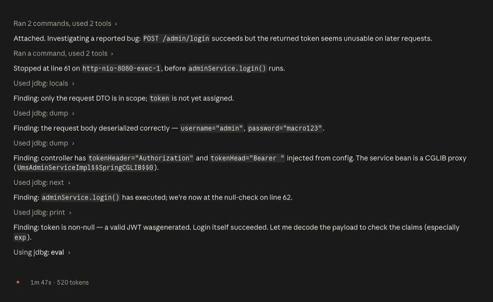
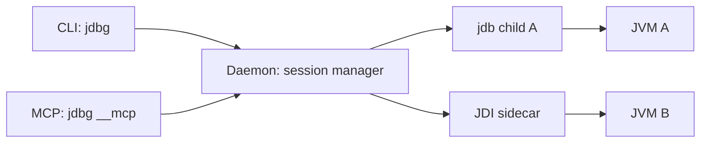

<div align="center">

<h1><code>jdbg</code></h1>

<p>
  <strong>Agent-friendly Java debugging from a Rust CLI.</strong>
</p>

<p>
  Wraps the JDK <code>jdb</code> with prompt-aware control, persistent sessions,
  an optional JDI sidecar backend, structured output, and native MCP tools for Claude Code,
  Codex, OpenCode, Pi, and humans.
</p>

<p>
  <a href="https://github.com/PieceOfFall/jdbg/releases/latest">
    
  </a>
  <a href="https://github.com/PieceOfFall/jdbg/blob/main/LICENSE">
    
  </a>
  
  
</p>

<p>
  <a href="#demo">Demo</a>
  &nbsp;&nbsp;
  <a href="#quick-start">Quick Start</a>
  &nbsp;&nbsp;
  <a href="#why-jdbg">Why jdbg</a>
  &nbsp;&nbsp;
  <a href="#agent-setup">Agent Setup</a>
  &nbsp;&nbsp;
  <a href="#command-surface">Commands</a>
  &nbsp;&nbsp;
  <a href="#architecture">Architecture</a>
</p>

</div>

<br>

<table>
  <tr>
    <td width="58%" valign="top">
      <h3>Debug Java without Bash glue</h3>
      <p>
        <code>jdbg</code> gives coding agents a stable debugging surface for Java:
        no sleeps, no temp files, no shell command injection surface, and no one-shot
        process that forgets the session.
      </p>
      <ul>
        <li><strong>Prompt-aware</strong>: reads <code>jdb</code> until the prompt or stop event is complete.</li>
        <li><strong>Stateful</strong>: one background daemon keeps sessions alive across calls.</li>
        <li><strong>Agent-native</strong>: exposes the same debugger through CLI and MCP tools.</li>
      </ul>
    </td>
    <td width="42%" valign="top">
      <h3>Built for agent workflows</h3>
      <table>
        <tr>
          <td><strong>Claude Code</strong></td>
          <td>MCP tools plus skill</td>
        </tr>
        <tr>
          <td><strong>Codex</strong></td>
          <td>MCP server config plus skill</td>
        </tr>
        <tr>
          <td><strong>OpenCode</strong></td>
          <td>Local MCP config plus skill</td>
        </tr>
        <tr>
          <td><strong>Pi</strong></td>
          <td>CLI skill</td>
        </tr>
      </table>
    </td>
  </tr>
</table>

## Demo

<p align="center">
  
</p>

## Quick Start

### Install

The installer downloads the right release artifact for your OS and adds `jdbg` to your user-level `PATH`.
Open a new terminal afterwards so the command is visible.

Windows:

```powershell
powershell -ExecutionPolicy Bypass -c "irm https://github.com/PieceOfFall/jdbg/releases/latest/download/java-agent-debugger-installer.ps1 | iex"
```

macOS / Linux:

```sh
curl --proto '=https' --tlsv1.2 -LsSf https://github.com/PieceOfFall/jdbg/releases/latest/download/java-agent-debugger-installer.sh | sh
```

<details>
<summary><strong>Already have Rust?</strong> Install with cargo or build from source.</summary>

```bash
# Install to ~/.cargo/bin/jdbg
cargo install --git https://github.com/PieceOfFall/jdbg.git

# Build from source
git clone https://github.com/PieceOfFall/jdbg.git
cd jdbg
cargo build --release
```

</details>

### Register With Your Agent

```bash
jdbg setup
```

Use non-interactive setup when provisioning machines:

```bash
jdbg setup --target claude,codex,opencode,pi --yes
jdbg setup --backend jdi --target codex --yes
jdbg setup --target codex --print
jdbg setup --target opencode --print
jdbg setup --target pi --print
```

### Debug Something

```bash
# Compile with debug info for locals and line breakpoints
javac -g Main.java

# Launch a debug session. The daemon starts automatically.
jdbg launch Main --classpath .

# Set a breakpoint and run
jdbg break-at Main 9
jdbg run

# Inspect the stopped program
jdbg locals
jdbg where
jdbg print myVar

# Move execution forward
jdbg step
jdbg cont

# Clean up
jdbg kill
jdbg daemon stop
```

In Claude Code, Codex, or OpenCode, ask the agent to debug the Java program.
It drives the same flow through `mcp__jdbg__*` tools. In Pi, the installed skill drives the `jdbg` CLI.

## Why jdbg

<table>
  <tr>
    <th align="left">Capability</th>
    <th align="left">What it changes</th>
  </tr>
  <tr>
    <td><strong>Prompt-aware reader</strong></td>
    <td>Commands finish when <code>jdb</code> is actually ready, not after a guessed sleep.</td>
  </tr>
  <tr>
    <td><strong>Persistent daemon</strong></td>
    <td>Every CLI or MCP call can reuse live debug sessions instead of restarting state.</td>
  </tr>
  <tr>
    <td><strong>Native MCP surface</strong></td>
    <td>Claude Code, Codex, and OpenCode get typed tool calls instead of shell-wrapped debugging.</td>
  </tr>
  <tr>
    <td><strong>Thread-only breakpoints</strong></td>
    <td><code>suspend: "thread"</code> stops the hit thread while heartbeat, ZK, Dubbo, and server threads keep running.</td>
  </tr>
  <tr>
    <td><strong>Runtime discovery</strong></td>
    <td><code>classes</code> and <code>methods</code> help agents find CGLIB proxies, generated classes, and exact signatures.</td>
  </tr>
  <tr>
    <td><strong>Focused inspection</strong></td>
    <td><code>locals</code>, <code>where</code>, <code>inspect</code>, <code>watch</code>, and <code>thread-locks</code> keep agent loops short.</td>
  </tr>
</table>

## Agent Setup

`jdbg setup` installs only the target-specific configuration that belongs to `jdbg`.
Removal is surgical and preserves sibling servers, user settings, and unrelated skill directories.
Interactive setup also asks which backend the installed skills should prefer. Use `--backend jdb|jdi`
for non-interactive provisioning; the preference is written into the skill guidance, while `jdb`
remains the CLI/MCP runtime default when no backend is passed on session creation.

<table>
  <tr>
    <th align="left">Target</th>
    <th align="left">What gets configured</th>
    <th align="left">Installed skill</th>
  </tr>
  <tr>
    <td><strong>Claude Code</strong></td>
    <td><code>mcpServers.jdbg</code> in <code>~/.claude.json</code>, plus <code>mcp__jdbg__*</code> permission in <code>~/.claude/settings.json</code></td>
    <td><code>~/.claude/skills/jdbg/SKILL.md</code></td>
  </tr>
  <tr>
    <td><strong>Codex</strong></td>
    <td><code>[mcp_servers.jdbg]</code> in <code>~/.codex/config.toml</code></td>
    <td><code>~/.codex/skills/jdbg/SKILL.md</code></td>
  </tr>
  <tr>
    <td><strong>OpenCode</strong></td>
    <td><code>mcp.jdbg</code> in <code>~/.config/opencode/opencode.json</code></td>
    <td><code>~/.config/opencode/skills/jdbg/SKILL.md</code></td>
  </tr>
  <tr>
    <td><strong>Pi</strong></td>
    <td>No MCP config</td>
    <td><code>~/.pi/agent/skills/jdbg/SKILL.md</code></td>
  </tr>
</table>

```bash
jdbg setup --remove
jdbg setup --remove --target codex
jdbg update
```

`jdbg update` detects which agents already had `jdbg` configured, installs the latest release, then re-registers the same targets.

## MCP Server

`jdbg __mcp` runs an rmcp-based stdio MCP server exposing the debugger as 36 native tools.
The MCP layer is a thin daemon client: it maps tool calls to the same command protocol used by the CLI, then renders the same results.

<table>
  <tr>
    <th align="left">Category</th>
    <th align="left">Tools</th>
  </tr>
  <tr>
    <td><strong>Sessions</strong></td>
    <td><code>launch</code>, <code>attach</code>, <code>status</code>, <code>list</code>, <code>kill</code></td>
  </tr>
  <tr>
    <td><strong>Breakpoints</strong></td>
    <td><code>break_at</code>, <code>break_in</code>, <code>catch</code>, <code>watch</code>, <code>unwatch</code>, <code>breakpoints</code>, <code>clear</code></td>
  </tr>
  <tr>
    <td><strong>Execution</strong></td>
    <td><code>run</code>, <code>cont</code>, <code>step</code>, <code>next</code>, <code>step_out</code>, <code>suspend</code>, <code>resume</code></td>
  </tr>
  <tr>
    <td><strong>Inspection</strong></td>
    <td><code>where</code>, <code>locals</code>, <code>print</code>, <code>dump</code>, <code>eval</code>, <code>inspect</code>, <code>threads</code>, <code>thread</code>, <code>frame</code>, <code>list_source</code>, <code>set</code>, <code>lock</code>, <code>threadlocks</code>, <code>raw</code></td>
  </tr>
  <tr>
    <td><strong>Discovery</strong></td>
    <td><code>classes</code>, <code>methods</code></td>
  </tr>
  <tr>
    <td><strong>Exception control</strong></td>
    <td><code>ignore</code></td>
  </tr>
</table>

Manual Claude-style MCP config for a development build:

```json
{
  "mcpServers": {
    "jdbg": {
      "command": "target/debug/jdbg",
      "args": ["__mcp"]
    }
  }
}
```

Codex config:

```toml
[mcp_servers.jdbg]
command = "target/debug/jdbg"
args = ["__mcp"]
```

OpenCode config:

```json
{
  "$schema": "https://opencode.ai/config.json",
  "mcp": {
    "jdbg": {
      "type": "local",
      "command": ["target/debug/jdbg", "__mcp"],
      "enabled": true
    }
  }
}
```

## Command Surface

<details open>
<summary><strong>Core commands</strong></summary>

```text
# Session lifecycle
jdbg launch <MainClass> [--backend jdb|jdi] [--classpath CP] [--sourcepath SP] [--name N] [-- app-args...]
jdbg attach [--backend jdb|jdi] [--host H] [--port P] [--sourcepath SP] [--name N]
jdbg status | list | kill [--session ID]
jdbg daemon start | stop | status

# Breakpoints and watchpoints
jdbg break-at <Class> <line> [-c <condition>] [-s thread|all]
jdbg break-in <Class> <method> [--args types] [-c <condition>] [-s thread|all]
jdbg catch <Exception> [--mode caught|uncaught|all]
jdbg watch <Class.field> [--mode access|modification|all]
jdbg unwatch <Class.field> [--mode access|modification|all]
jdbg breakpoints | clear <spec>
jdbg ignore <Exception> [--mode caught|uncaught|all]

# Runtime discovery
jdbg classes [pattern]
jdbg methods <Class>

# Execution control
jdbg run | cont | step | next | step-out

# Inspection
jdbg where [--all] | locals | print <expr> | dump <obj> | eval <expr>
jdbg inspect <expr> [--max-elements N]
jdbg threads | thread <id> | frame <up|down> [n] | list-source [line]
jdbg suspend [thread-id] | resume [thread-id]
jdbg set <lvalue> <value>
jdbg lock <expr> | thread-locks [thread-id]
jdbg raw <jdb command...>

# Setup and maintenance
jdbg setup [--remove] [--print] [--target claude,codex,opencode,pi|auto|all|none] [--backend jdb|jdi] [--yes]
jdbg update
```

</details>

Global flags:

| Flag | Purpose |
|---|---|
| `--session <id>` | Target a specific debug session. Defaults to the sole live session when unambiguous. |
| `--json` | Emit machine-readable JSON instead of human-readable text. |
| `--timeout <secs>` | Override per-command timeout. |
| `--jdb-path <path>` | Use an explicit `jdb` executable. |

Backend selection is made only when creating a session. The default `jdb` backend is the compatibility path
and supports the full command surface. The `jdi` backend is currently attach-only and uses a local Java sidecar
for structured runtime data; it supports `attach`, `threads`, line `break-at`, `cont`, `next`, `where`, `locals`,
`thread`, and safe JSON `inspect`. Unsupported JDI commands fail explicitly instead of falling back to `jdb`.

## Architecture

Two clients feed one daemon. The daemon owns live backend sessions and the in-memory session map.



The internal dependency direction stays simple:

```text
bin -> cli / output -> client / daemon -> backend -> session / jdi -> jdb / jdkpath -> error / protocol / registry
```

See [`DESIGN.md`](DESIGN.md) for the full design reference.

## Requirements

| Requirement | Notes |
|---|---|
| JDK | JDK 8-21+ with `jdb` on `PATH` or discoverable via `JAVA_HOME`. |
| Debug info | Compile Java with `javac -g` for locals and reliable line breakpoints. |
| Rust | Rust 1.85+ only when installing through cargo or building from source. |

For JDWP attach on JDK 8, start the target with `address=5005` or `address=localhost:5005`.
`address=*:5005` is JDK 9+ syntax.

When building from source, `cargo build` also builds `jdbg-jdi-sidecar.jar` next to the `jdbg` binary when
`javac` and `jar` are available. Override sidecar discovery with `JDBG_JDI_SIDECAR_JAR` or the Java runtime
with `JDBG_JDI_JAVA`.

`classes` works without a pattern, but that lists every loaded class; pass a pattern in real application
servers. `watch --mode all` creates separate access and modification watchpoints, so `unwatch --mode
modification` removes only the write watchpoint and leaves access watchpoints active.

## Building And Testing

```bash
cargo build
cargo build --release
cargo test
```

Tests cover parser fixtures from real `jdb` transcripts, reader behavior, protocol mapping, MCP tools, sessions, watchpoints, and end-to-end flows where the environment has a JDK.

## License

Licensed under the [Apache License 2.0](LICENSE).
